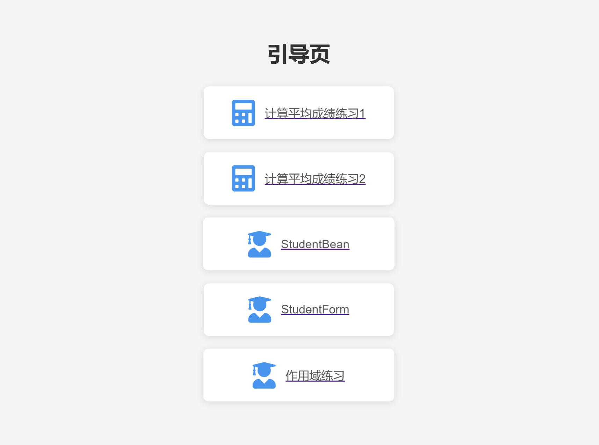
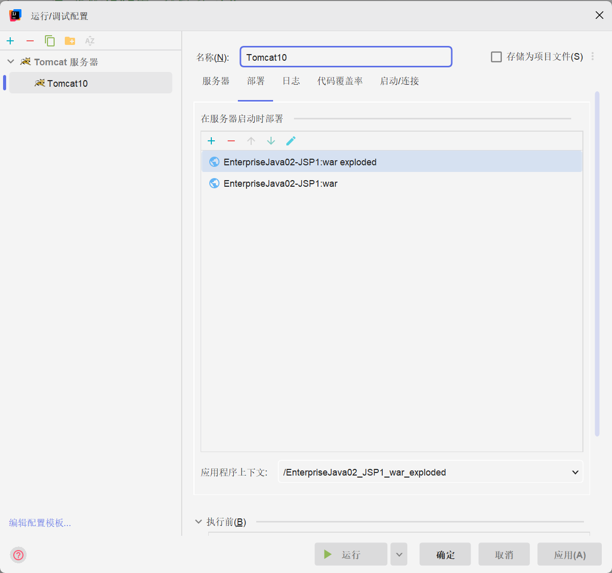

# 企业JAVA第二次练习 JSP
---
- 任务引导页:[index.jsp](src%2Fmain%2Fwebapp%2Findex.jsp)

每个页面拥有一些基础的样式,保证基本的美观~
# 启动
使用`tomcat`启动

# 任务1
> 创建一个简单web应用，创建computeAverage.jsp文件，用于计算、输出学生三门课的平时成绩，在服务器上部署该web并运行

## 参考代码:
```jsp
<body>
    <h3>计算学生的平均成绩：</h3>    <br>  
    <%
    double math=90.0, chinese=85, english=72, average;
      average=(math+chinese+english)/3;
      out.print(average);
   %>  
  </body>
```
- 熟悉JSP基本标签页 `<%...%>`的使用
## Code:
[computeAverage.jsp](..%2Fsrc%2Fmain%2Fwebapp%2Fexercise%2FcomputeAverage.jsp)

# 任务2
>修改平均的jsp文件，定义计算平均的方法，计算、输出平均成绩

- 了解JSP声明式语法:
```jsp
  <%!
 //申明一个常量
 final String SEPARATOR =".";
 //声明一个方法
 public String convertAmountWithSeparator(String money) {
     int index = money.indexOf(SEPARATOR);
     String str="";
     if(index==-1)
         str = money+".00";
     return str;
 }
%>
```
## Code
[computeAverageV2.jsp](..%2Fsrc%2Fmain%2Fwebapp%2Fexercise%2FcomputeAverageV2.jsp)

# 任务3
>1.定义一个学生Student javaBean，包含name和number两个属性 \
>2.创建一个jsp页面，使用Student这个javabean，应set和get属性值输出

## JavaBean 运行时错误

当运行 JavaBean 时，如果出现 `cannot be resolved to a type` 的提示，源码如下：

```exception
org.apache.jasper.JasperException: Unable to compile class for JSP:
An error occurred at line: 18 in the jsp file: /javabean.jsp
XXX(JavaBean类) cannot be resolved to a type
```
这是由于 Java 规定 JavaBean 一定要放在命名包里，不能放在默认包里，否则 Bean 文件将无法解析。

### 解决方法

解决 Bean 文件无法解析的问题的方法如下：

1. 在 Bean 文件的开头添加 `package 包名;` 字段。
2. 将 Bean 文件放入对应的 `class` 文件目录下即可。
## Bean的基本使用
### 在 JSP 中使用 JavaBean

#### 1. 引入 JavaBean

在 JSP 页面中，可以使用 `<jsp:useBean>` 标签来引入 JavaBean。可以指定要使用的 Bean 的 ID、类和作用域。

```jsp
<jsp:useBean id="student" class="com.example.Student" scope="request"/>
```

#### 2. 设置属性

使用 `<jsp:setProperty>` 标签来设置 JavaBean 的属性。

```jsp
<jsp:setProperty name="student" property="name" value="张三"/>
<jsp:setProperty name="student" property="age" value="20"/>
```

#### 3. 获取属性

使用 `<jsp:getProperty>` 标签从 JavaBean 中获取属性值。

```jsp
<p>学生姓名: <jsp:getProperty name="student" property="name"/></p>
<p>学生年龄: <jsp:getProperty name="student" property="age"/></p>
```
## Code
[Student.jsp](..%2Fsrc%2Fmain%2Fwebapp%2Fexercise%2FStudent.jsp)

# 任务4
>1.创建一个表单页面，接受用户的学生成绩输入，交给请求处理页面\
>2.创建一个请求处理页面，计算学生平时成绩，并输出
## 了解Request对象
在 JSP (JavaServer Pages) 中，`request` 对象是一个重要的内置对象，代表了客户端发起的请求。它提供了访问和处理与请求相关的数据和信息的功能。以下是 `request` 对象的详细介绍，包括其特点、属性、方法和常见用法。

### 1. `request` 对象的基本概念

- **定义**：`request` 对象是一个 `javax.servlet.http.HttpServletRequest` 类型的实例，包含了所有与客户端请求相关的信息。
- **生命周期**：`request` 对象在整个请求处理过程中有效，通常在请求结束后会被销毁。

### 2. `request` 对象的特点

- **存储请求信息**：`request` 对象可以存储请求的属性，例如请求参数、请求头、请求方法等。
- **跨页面共享数据**：可以通过 `request` 对象在不同的 JSP 页面或 Servlet 之间共享数据。

### 3. 主要属性和方法

#### 3.1 请求参数

- **获取请求参数**：使用 `getParameter(String name)` 方法可以获取表单提交的参数值。

  ```jsp
  String username = request.getParameter("username");
  ```

#### 3.2 请求头

- **获取请求头**：使用 `getHeader(String name)` 方法可以获取请求头的信息。

  ```jsp
  String userAgent = request.getHeader("User-Agent");
  ```

#### 3.3 请求方法

- **获取请求方法**：使用 `getMethod()` 方法可以获取请求的 HTTP 方法（如 GET、POST）。

  ```jsp
  String method = request.getMethod();
  ```

#### 3.4 请求路径

- **获取请求 URI**：使用 `getRequestURI()` 方法可以获取请求的 URI。

  ```jsp
  String uri = request.getRequestURI();
  ```

#### 3.5 属性管理

- **设置和获取属性**：可以使用 `setAttribute(String name, Object value)` 和 `getAttribute(String name)` 方法来设置和获取请求范围内的属性。

  ```jsp
  request.setAttribute("key", "value");
  String value = (String) request.getAttribute("key");
  ```

### 4. 常见用法

#### 4.1 表单处理

在 JSP 页面中，`request` 对象经常用于处理用户提交的表单数据。例如：

```jsp
<%@ page language="java" contentType="text/html; charset=UTF-8" pageEncoding="UTF-8" %>
<!DOCTYPE html>
<html lang="zh">
<head>
    <meta charset="UTF-8">
    <title>表单处理</title>
</head>
<body>
    <h1>用户输入</h1>
    <form action="process.jsp" method="post">
        姓名: <input type="text" name="username"><br>
        <input type="submit" value="提交">
    </form>
</body>
</html>
```

在 `process.jsp` 中，您可以使用 `request` 对象获取提交的数据：

```jsp
<%@ page language="java" contentType="text/html; charset=UTF-8" pageEncoding="UTF-8" %>
<%
    String username = request.getParameter("username");
%>
<!DOCTYPE html>
<html lang="zh">
<head>
    <meta charset="UTF-8">
    <title>结果</title>
</head>
<body>
    <h1>提交结果</h1>
    <p>用户名: <%= username %></p>
</body>
</html>
```

#### 4.2 共享数据

使用 `request` 对象可以在多个 JSP 页面之间共享数据。例如，在一个 JSP 页面中设置属性：

```jsp
<%
    request.setAttribute("message", "欢迎访问我们的网站！");
%>
```

然后在另一个 JSP 页面中获取并使用该属性：

```jsp
<p>消息: <%= request.getAttribute("message") %></p>
```

### 总结

- `request` 对象在 JSP 中是一个重要的组件，允许开发人员访问和处理与客户端请求相关的数据。
- 它支持获取请求参数、请求头、请求方法以及存储请求范围内的属性，使得 JSP 页面能够动态响应用户输入。
- 通过 `request` 对象，开发人员可以构建交互式的 Web 应用程序，增强用户体验。

## Code
[StudentForm.jsp](src%2Fmain%2Fwebapp%2Fexercise%2FStudentForm.jsp) \
[StudentFormResult.jsp](src%2Fmain%2Fwebapp%2Fexercise%2FStudentFormResult.jsp)
# 任务5
>1.分别设置不同作用域范围内的属性，并输出属性值\
>2.测试不同作用域对象的区别
# 了解JSP作用域
JSP作用域包括 page、request、session和application：
- application：对于整个Web应用有效，一旦JSP、Servlet将数据放入application中，该数据将可以被该应用其他所有的jsp和servlet访问；
- session：仅对一次会话有效，一旦jsp和servlet将数据放入session中，该数据将被本次会话其他jsp和servlet访问；
- request：仅对本次请求有效，一旦jsp、servlet将数据放入request中，该数据将可以被该次请求的其他jsp和servlet访问；
- page：仅对当前页面有效，一旦jsp，servlet将数据放入page范围中，该数据只可以被当前页面的jsp脚本、声明部分访问。

## Code
通过Iframe标签页进行展示
- [ScopeExercise_first.jsp](src%2Fmain%2Fwebapp%2Fexercise%2FScopeExercise_first.jsp)
- [ScopeExercise_second.jsp](src%2Fmain%2Fwebapp%2Fexercise%2FScopeExercise_second.jsp)
- [ScopeExerciseShow.jsp](src%2Fmain%2Fwebapp%2Fexercise%2FScopeExerciseShow.jsp)